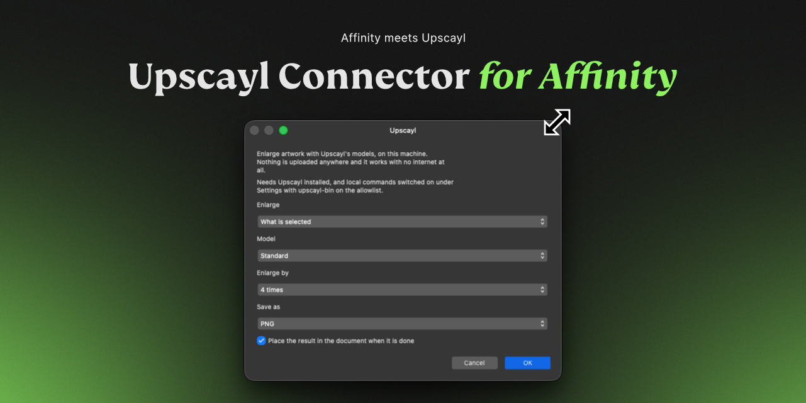

# Upscayl for Connector for Affinity

Enlarge artwork with [Upscayl](https://upscayl.org) on your own computer. The image never leaves the machine: Connector for Affinity exports it, runs Upscayl locally, and can place the enlarged result back into the Affinity document.

## What you need

- **Connector for Affinity** installed and connected to Affinity.
- [Upscayl](https://upscayl.org) installed locally.
- Local commands enabled in **Settings → Local tools**, with `upscayl-bin` approved on the allowlist.

The connector looks for Upscayl in its usual macOS, Windows, and Linux locations. If yours lives elsewhere, set the exact path to `upscayl-bin` under the connector's settings.

## Install from the Marketplace

1. Open **Connector for Affinity**.
2. Choose **Browse** in the sidebar.
3. Search for **Upscayl**.
4. Select it and press **Install**.
5. In **Settings → Local tools**, allow `upscayl-bin`.
6. Open **Upscayl** from the Connectors list or add it to the Floating Bar.

No account, API key, or internet connection is required once Upscayl is installed.

## Use it in Affinity

1. Under **Enlarge**, choose the selection, area, artboard, layer, spread, document, or a file.
2. Choose an Upscayl model. Press refresh beside the field to read the models installed with your copy of Upscayl.
3. Choose a scale of 2×, 3×, or 4×.
4. Optionally choose PNG, JPEG, or WebP output.
5. Press **Upscale**.

Connector for Affinity reports the input and expected output dimensions before starting. When the job finishes, the result is placed over the source artwork by default; turn that off if you only want to save or inspect the generated file.

## Controls

| Control | What it changes |
| --- | --- |
| **Enlarge** | Chooses the artwork or local file to process. |
| **Model** | Chooses an installed Upscayl model. Refresh reads the models available on this computer. |
| **Enlarge by** | Sets a 2×, 3×, or 4× scale. Larger scales can create very large output files. |
| **Save as** | Chooses PNG, JPEG, or WebP. WebP automatically falls back to PNG if its maximum dimension would be exceeded. |
| **Place the result in the document when it is done** | Places the completed enlargement back into the current Affinity document. |
| **Upscayl command** | An optional connector setting for a non-standard location or a compatible Real-ESRGAN binary. |

## Notes

- Upscaling uses your local CPU/GPU and may take time for large artwork.
- The connector checks the installed model list before launching a run, so a stale model selection gives a clear error instead of a failed command.
- The result stays in Connector for Affinity's handover folder even when automatic placement is turned off.

## Development

This connector consists of [`app.json`](app.json), which describes the form and approved local command, and [`index.js`](index.js), which finds and runs `upscayl-bin`. Install it from the Marketplace for normal use; the files here are for review and development.
